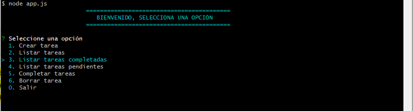

# Tareas-App interactiva

Este proyecto se basa en una aplicación de escritorio para crear, listar y hacer un organigrama de las tareas diarias de una persona.

### Funcionalidades

- Crear tareas
- Listar tareas
- Listar tareas completadas
- Listar tareas pendientes
- Completar tarea
- Editar tarea
- Borrar tarea

La aplicación es totalmente interactiva, cuenta con interfaz amigable y facil de entender

### Notas

- La app maneja persistencia de los datos a través de un archivo data.json
- Facilmente escalable para agregar nuevas funciones o darle otro enfoque al proyecto
- La navegaación es por teclado usando uso de la libreria **inquirer**

### Imagen



### Dependencias

```
"colors": "^1.4.0",
"inquirer": "^8.1.0",
"uuid": "^8.3.2"
```
